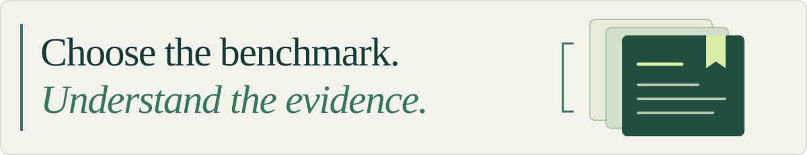

# Awesome Agent Harness Benchmarks 

<picture>
  <source media="(prefers-color-scheme: dark)" srcset="assets/readme-hero-dark.svg">
  
</picture>

115 public benchmarks, studies, and evaluation tools for AI agents and harnesses. Compare their tasks, grading methods, environments, and limitations.

[**Explore the catalog →**](https://zeredy879.github.io/awesome-agent-harness-benchmarks/) · [简体中文](README.zh-CN.md) · [日本語](README.ja.md) · [한국어](README.ko.md)

On this page

## Contents

- [Choose a benchmark](#choose-a-benchmark)
- [Compare harnesses](#compare-harnesses)
- [Data and methodology](#data-and-methodology)
- [Contribute](#contribute)

## Choose a benchmark

| I want to evaluate…                            | Start here                                                           |
| :--------------------------------------------- | :------------------------------------------------------------------- |
| Fixing issues in a code repository             | [SWE-bench](https://github.com/SWE-bench/SWE-bench)                  |
| Completing tasks in a terminal                 | [Terminal-Bench](https://github.com/harbor-framework/terminal-bench) |
| Using tools and APIs across multiple steps     | [ToolSandbox](https://github.com/apple-aiml-research/ToolSandbox)    |
| Getting things done on websites                | [WebArena](https://github.com/web-arena-x/webarena)                  |
| Working with desktop applications              | [OSWorld](https://github.com/xlang-ai/OSWorld)                       |
| Recalling information from long conversations  | [LongMemEval](https://github.com/xiaowu0162/LongMemEval)             |
| Resisting prompt injection through tools       | [AgentDojo](https://github.com/ethz-spylab/agentdojo)                |
| Researching and answering questions with tools | [GAIA](https://huggingface.co/datasets/gaia-benchmark/GAIA)          |

Looking for more options? The [full Markdown catalog](docs/catalog.md) includes specialized workloads, scoring details, and setup constraints.

## Compare harnesses

An **agent harness** manages the model's tools, context, memory, permissions, and execution. To study this layer, start with:

- [Harness-Bench](https://github.com/Qihoo360/harness-bench) - Compares model–harness configurations on offline workspace tasks.
- [ShellBench](https://github.com/openclaw/shellbench) - Evaluates full agent configurations with task traces; formerly OpenClaw ClawBench.
- [SkillsBench](https://github.com/benchflow-ai/skillsbench) - Tests how reusable skills affect agent performance.

For a whole-harness comparison, document each configuration and match the model, tasks, environment, and budgets outside the change being tested. For a component test, such as adding skills, hold the rest fixed. Use the [comparison report template](docs/comparison-template.md) to record success, cost, latency, and safety separately.

## Data and methodology

Every catalog entry links to a public source and describes its tasks, grading, environment, and a concrete limitation. Weekly checks track source availability; they are not independent reproductions. This repository is a selection guide, not a leaderboard.

For researchers: [Methods and evidence](docs/research.md) · [Catalog updates](docs/updates.md) · [Citation](CITATION.cff).

For agents: [Markdown digest](site/agent.md) · [Catalog JSON](data/catalog.json) · [Schema and source audit](data/README.md).

Related lists: [Harness Engineering](https://github.com/walkinglabs/awesome-harness-engineering) · [AI Agent Benchmarks](https://github.com/serenakeyitan/awesome-ai-agent-benchmarks) · [Agent Evals](https://github.com/genai-io/awesome-agent-evals).

## Contribute

[Suggest a benchmark](https://github.com/zeredy879/awesome-agent-harness-benchmarks/issues/new?template=benchmark.yml) or [report a correction](https://github.com/zeredy879/awesome-agent-harness-benchmarks/issues/new?template=correction.yml) with a source link and a short explanation.

For pull requests, see [CONTRIBUTING.md](CONTRIBUTING.md). Coding agents should read [AGENTS.md](AGENTS.md). Questions and comparisons are welcome in [Discussions](https://github.com/zeredy879/awesome-agent-harness-benchmarks/discussions).

  
